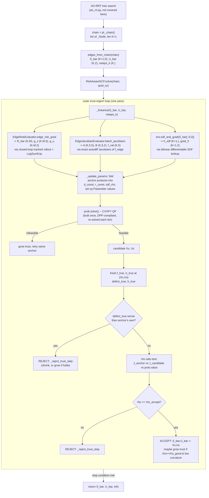

# The Risk-Aware SCP Refiner (`src/scp_vel.py`) — Complete Walkthrough

This document explains, end to end and with no gaps, how `src/scp_vel.py` turns a
raw AO-RRT tree solution into a locally-optimal, risk-aware, collision-free
trajectory. It covers every piece of math involved, exactly which array has
which shape at every step, and exactly which function in which file computes
it. AO-RRT's own tree-search algorithm is **not** covered here (only the
`edges_from_chain` extraction that hands its output to SCP) — see `ao_rrt.py`
for that.

Read order: this file is written top-to-bottom, from "what state/control mean"
up to "what the outer loop does with a QP solve." Each part names the exact
file and function so you can jump to source. Line numbers refer to the state
of the files at the time this document was written and may drift — search for
the function name if a line number looks stale.

---

## 1. Where this sits in the pipeline

```
AO-RRT tree search (ao_rrt.py)
        │  produces a tree; best_goal / nearest node picks ONE root→leaf path
        ▼
chain = pl._chain()                     list[_Node], length K+1
        │
        ▼
edges_from_chain(chain)  (scp_vel.py)   S_bar (K+1,5), U_bar (K,2), nsteps_k (K,)
        │  this becomes ITERATION 1's SCP "anchor"
        ▼
RiskAwareSCP.solve(chain, goal_xy)      the outer trust-region loop
        │  each outer iteration:
        │    1. linearize risk + dynamics + SDF at the current anchor
        │    2. solve one convex QP (CVXPY) around that anchor
        │    3. accept/reject the QP's candidate via a true-cost ratio test
        ▼
(S_bar, U_bar, info)                    refined (K+1,5)/(K,2) trajectory
```

The refiner never changes the **transcription** AO-RRT chose (how many edges
`K`, how many RK4 substeps `nsteps_k` each edge gets) — it only moves the
continuous anchor `(s_bar_k, u_bar_k)` within that fixed structure. This is
why `nsteps_k` is described throughout as "structural."

---

## 2. Notation & dimensions (reference table)

| Symbol | Code name | Shape | Meaning |
|---|---|---|---|
| `NX` | `RiskAwareSCP.NX` | `5` | state dimension |
| `NU` | `RiskAwareSCP.NU` | `2` | control dimension |
| `K` | `K` | scalar | number of edges (= number of tree nodes visited minus the root) |
| `K+1` | — | scalar | number of knots (nodes), including both endpoints of every edge |
| `M` | `M` | scalar `= dist_grid_n**2` | number of disturbance scenarios in the CVaR ensemble |
| `T` | `T` | scalar `= max_k nsteps_k` | padded rollout length (RK4 substeps) shared by all K edges in one batched call |
| `z` / state | `s`, `S_bar`, `Z_bar` | `(5,)` per knot | `[x, y, theta, v_b, omega]` — position (m), heading (rad, **never wrapped**), body-frame forward speed (m/s), yaw rate (rad/s) |
| `u` / control | `u`, `U_bar` | `(2,)` per edge | `[v_cmd, omega_cmd]` — commanded forward speed and yaw rate |
| bar notation | `S_bar`, `U_bar`, `s_bar_k`, `u_bar_k` | — | the **current SCP outer-loop anchor** — i.e. the Taylor-expansion point of this iteration, never a QP decision variable. Iteration 1 = the AO-RRT solution; every iteration after = whatever the previous QP solve was **accepted** |

Every "batched" quantity below stacks these per-knot/per-edge/per-scenario
building blocks along leading axes `(K, ...)`, `(K, M, ...)`, or `(T+1, ...)`.

---

## 3. Common infrastructure (also used outside SCP)

### 3.1 The rover dynamics model — `src/dynamics_vel.py`

State derivative (`_deriv`, `dynamics_vel.py:41`):

```
statedot = [ v_b cos(theta),
             v_b sin(theta),
             omega,
             vdot_b,
             vdot_omega ]
```

The first three rows are **exact unicycle kinematics** (no approximation).
The last two (`vdot = vdot_b, vdot_omega`) are a learned velocity model:

```
v = [v_b, omega]                                    (2,)
nominal = [a1*v_b + b1*u0,  a2*omega + b2*u1]        (2,)   -- A_n@v + B_n@u
residual = Phi(v,u) @ u                              (2,)   -- NN correction, RAW units
vdot = nominal + residual
```

- `p = [a1, a2, b1, b2]` packs `A_n = diag(a1,a2)`, `B_n = diag(b1,b2)` —
  system-identified constants, `config.py`'s `DynParams.a_diag/b_diag`
  (defaults `a_diag=(-2.7337,-2.5621)`, `b_diag=(2.6867,2.6418)`).
- `Phi(v,u)` is a small MLP (`residual_phi_predictor.py`): `phi_matrix(params, v)`
  runs `v` through two ReLU layers to a `(2,2)` matrix, then
  `phi_net_forward` computes `Phi(v) @ u`, de-normalized by `y_std` (raw
  units). **Important**: the net is *scale-only* — there is no bias/mean term
  in the de-normalization (`y_hat = y_hat_n * y_std`, no `+ y_mean`) — so the
  whole nominal+NN model is **exactly linear in `u`**:
  `vdot = A_n @ v + D_eff(v) @ u`, with `D_eff(v) = B_n + diag(y_std) @ Phi(v)`
  (`_D_eff`, `dynamics_vel.py:127`). This linearity is what makes the
  closed-loop **model-inversion** tracking controller (§4.3) solvable as a
  plain `2x2` linear system.

**RK4 step** (`_step`, `dynamics_vel.py:63`): the standard 4-stage
Runge-Kutta integrator, one step of size `dt`:

```
k1 = deriv(z,          u)
k2 = deriv(z + dt/2*k1, u)
k3 = deriv(z + dt/2*k2, u)
k4 = deriv(z + dt*k3,   u)
z_next = z + dt/6 * (k1 + 2 k2 + 2 k3 + k4)
```

`dt = cfg.dyn.dt` (default `0.05` s), constant across all RK4 stages of one
step; `u` is also constant across a whole step (it only changes edge to
edge, not sub-step to sub-step) — that's what "constant-control rollout"
means below.

**Rollout** (`_rollout`, `dynamics_vel.py:73`): applies `_step` `nsteps`
times under one constant control `u`, via `jax.lax.scan`, and returns
`[z0, z1, ..., z_nsteps]`, shape `(nsteps+1, 5)`. `nsteps` is a **static**
(compile-time) argument — `lax.scan`'s trip count must be a Python int, so
one jitted `_rollout` call only ever handles ONE value of `nsteps` across its
whole (possibly vmapped) batch. This is the root cause of the "grouping by
distinct `nsteps_k`" machinery in §6.3.

**Edge propagation map** `f_edge` (`_edge`, `dynamics_vel.py:96`): just the
*last* row of `_rollout` — the terminal state after `nsteps` constant-`u` RK4
steps starting at `z0`. This is exactly the discrete-time map the SCP
multiple-shooting defect constraint (§8.4, Constraint II) linearizes.

### 3.2 Exact edge Jacobians — `A_k`, `B_k`, `f_k`

```
A_k = d f_edge / d z0     shape (5,5)     -- jax.jacobian, argnums=0  (_edge_jacz)
B_k = d f_edge / d u      shape (5,2)     -- jax.jacobian, argnums=1  (_edge_jacu)
f_k = f_edge(z0, u)       shape (5,)
```

These are **exact reverse/forward-mode autodiff derivatives through the
whole RK4×nsteps rollout (including the NN)** — not finite differences, not
an analytic approximation. `_edge_jac_single` (`dynamics_vel.py:107`) returns
all three together for one edge; `_batch_edge_jac` vmaps that over a whole
knot sequence sharing one `nsteps` (`dynamics_vel.py:114`). The host-facing
entry point is `VelPoseDynamics.batch_jacobians(Z, U, nsteps, dt)`
(`dynamics_vel.py:338`), consumed by `EdgeJacobianEvaluator` (§6.3).

### 3.3 Signed distance field & collision checking — `src/environment.py`

**Bilinear differentiable lookup** (`_bilin_cell`, `environment.py:25`) is the
single primitive every spatial grid query in this codebase goes through
(SDF, terrain risk map, both). Given a 2-D grid `sdf` (shape `(H,W)`) and a
continuous *cell* coordinate `c = [gx, gy]` (NOT meters — grid-cell units):

```
gx, gy = clip(c[0], 0, W-1), clip(c[1], 0, H-1)
x0, y0 = floor(gx), floor(gy)                  # lower-left corner
x1, y1 = min(x0+1, W-1), min(y0+1, H-1)        # upper-right corner (clamped)
wx, wy = gx - x0, gy - y0                      # fractional offsets in [0,1]
v0 = sdf[y0,x0]*(1-wx) + sdf[y0,x1]*wx         # interpolate along x at row y0
v1 = sdf[y1,x0]*(1-wx) + sdf[y1,x1]*wx         # interpolate along x at row y1
value = v0*(1-wy) + v1*wy                      # interpolate along y
```

This is textbook bilinear interpolation. The reason it's implemented in JAX
(not a lookup + `scipy`) is that `jax.grad`/`jax.value_and_grad` can
differentiate straight through it: `floor()` has zero gradient almost
everywhere, but the *weights* `wx, wy` and the four corner reads are smooth
in `c`, so gradients of `value` w.r.t. `c` are the exact analytic bilinear
gradient. `_sdf_value_and_grad` (`environment.py:41`) is this function
wrapped in `jax.value_and_grad(argnums=1)` and `vmap`ped over a batch of
points — this is exactly how the linearized SDF constraint (§8.4, Constraint
III) and the risk-map lookup (§5) both get exact spatial gradients "for
free."

**Meters ↔ cells conversion**: `Environment.resolution = 1/res_m` (cells per
meter). Every world-space `(x,y)` point must be multiplied by `resolution`
before it's a valid grid-cell coordinate for `_bilin_cell`. Because this
scaling is linear, the chain rule means a gradient computed in cell-space
must be **multiplied by `resolution`** to become a gradient in meter-space —
that's exactly what `Environment.sdf_and_grad` does at `environment.py:266`
(`np.asarray(g) * self.resolution`).

**The signed distance field itself** (`_true_signed_sdf`, `environment.py:51`):
unlike a typical "distance to nearest obstacle, clamped at 0 inside
obstacles" SDF, this one is **signed and unclamped**:

```
d_out = distance_transform_edt(NOT obstacle)   # 0 on obstacle cells, distance outward elsewhere
d_in  = distance_transform_edt(obstacle)        # 0 on free cells, distance inward elsewhere
sdf   = d_out - d_in                            # > 0 outside obstacles, < 0 inside
```

This matters because it gives a **non-zero gradient inside an obstacle** too
— if a linearized keep-out constraint (§8.4-III) is ever built around a knot
that's already penetrating an obstacle, the gradient still points the right
way to push it back out, rather than being flat/uninformative at `sdf=0`
clamp.

**`Environment.sdf_and_grad(pts)`** (`environment.py:259`): the batched,
autodiff entry point used throughout SCP. `pts` is `(N,2)` meters →
`(vals (N,), grads (N,2))`, both in meters. This is what `_linearize` (§7)
calls once per outer iteration over **all `K+1` knots at once**.

**Collision test** (`Environment.collision_free`, `environment.py:184`): a
point is collision-free (for a disc-shaped robot of radius `disc_radius`) iff
`sdf(x,y) > clearance + disc_radius`. SCP's own version of "stay `disc_radius`
away from every obstacle" is the linearized inequality in §8.4 (Constraint
III), evaluated with the same `sdf_and_grad`.

### 3.4 Terrain risk map — `map/risk_map.py`

Baked **once, offline**, into a dense `(H,W)` grid `env._risk_dev`
(`environment.py:168`) — queried on-device with the exact same
`_bilin_cell` primitive as the SDF (just a different grid). Three independent
hazard layers, fused as a probabilistic OR (`TerrainRiskMap.compute`,
`risk_map.py:97`):

```
p_fail = 1 - (1 - r_slope) * (1 - r_rough) * (1 - r_obstacle)      # in [0,1]
```

- `r_slope = w_slope * logistic((slope - slope_crit) / slope_width)` — a
  soft ramp, 0.5 at the mobility-limit slope angle (default 20°).
- `r_rough = w_rough * clip(local_elevation_std / rough_scale, 0, 1)` — local
  terrain roughness (rocks/undulation), via a windowed std of the height
  map.
- `r_obstacle = w_obs * (1 if d_m<=0 else exp(-0.5*(d_m/sigma)^2))` — a
  Gaussian halo around the (signed) obstacle boundary `d_m`, saturating to
  the layer max **inside** the obstacle (the `d_m<=0` branch), so risk stays
  monotone rather than decaying back toward 0 deep inside solid rock.

This `p_fail` grid is exactly `RiskMap(x)` in the LogSumExp formula of §5 —
`env._risk_dev` is queried at every substep of every edge's closed-loop
tracked trajectory.

### 3.5 CVaR (Conditional Value at Risk) — `src/risk_planner.py`

Given a finite sample `z` (`n` numbers, e.g. one edge's `R[k,:]` over the `M`
disturbance scenarios), `cvar(z, alpha)` (`risk_planner.py:102`) computes the
**average of the worst `alpha`-fraction** of samples:

- `alpha = 1` → plain mean (risk-neutral).
- `alpha → 0` → plain max (worst-case / robust).
- otherwise: sort `z` descending, dot with `cvar_weights(n, alpha)`
  (`risk_planner.py:120`) — full weight `1/(alpha n)` on the worst
  `floor(alpha n)` samples, the remaining fractional weight on the boundary
  sample, zero elsewhere. This is the *exact* discrete estimator of the
  Rockafellar–Uryasev dual form.

The QP's own CVaR handling (§8.4, Constraint VI + §8.3 objective) is the
**primal epigraph form** of the identical quantity:

```
CVaR_alpha(R) = min_tau  tau + (1/(alpha n)) * sum_i max(0, R_i - tau)
```

`risk_planner.cvar` and the QP's `(tau, eta)` variables are two ways of
computing the *same number* — used respectively for `_true_cost`'s exact,
non-linearized evaluation (§9.2) and for the QP's convex surrogate (§8.3),
so the ratio test in §9.4 compares like with like.

---

## 4. Closed-loop tracked rollout — `dynamics_vel.py`, `_tracked_rollout`

**Why closed-loop at all?** The edge-risk term `R_{k,m}` (§5) is meant to
answer "how risky is edge `k` if disturbance scenario `m` actually happens
while the rover *tries to follow* its planned trajectory" — not "how risky is
the open-loop nominal path." So risk is evaluated along a **simulated
closed-loop tracking rollout**: a reference is generated open-loop, then a
two-loop feedback controller tracks it while a constant disturbance is
injected into the true dynamics.

### 4.1 The reference profile

`Zref = _rollout(s_bar_k, u_bar_k, T, dt, ...)` — the plain open-loop rollout
from §3.1, under the constant anchor control `u_bar_k`, shape `(T+1,5)`.

`_ref_pose_vel(Zref)` (`dynamics_vel.py:209`) reads off, for `t=0..T-1`
(i.e. dropping the last row):

```
P_d     = Zref[:-1, 0:2]                              (T,2)   desired position
Theta_d = Zref[:-1, 2]                                (T,)    desired heading
V_d_I   = [v_b*cos(Theta_d), v_b*sin(Theta_d)]         (T,2)   desired INERTIAL-frame velocity
```

No extra dynamics/NN evaluation needed — pose and velocity are read straight
off the state.

### 4.2 Outer loop: pose-feedback reference correction (`_outer_ref`)

One step, Kanayama-style unicycle trajectory tracking (`dynamics_vel.py:222`).
Given the rover's *actual* current state `z` (position `p`, heading `psi`)
and the desired `(p_d, theta_d, v_d_I)` at this instant:

```
p_tilde   = p - p_d                                    position error (2,)
v_ref_I   = v_d_I - Kp @ p_tilde                        (eq. 14) corrected inertial-frame reference velocity
v_ref_x   = [cos(psi), sin(psi)] . v_ref_I              projection onto the ACTUAL current heading
                                                          -> body-frame forward-speed reference
psi_ref   = atan2(v_ref_I) if |v_ref_I|^2 > v_eps_sq else theta_d      (eq. 16)
psi_dot_ref = wrap(psi_ref - psi_ref_prev) / dt          backward finite difference
omega_ref = psi_dot_ref - k_psi * wrap(psi - psi_ref)    (eq. 15)
return v_ref = [v_ref_x, omega_ref],  psi_ref            (psi_ref carried to next step)
```

`Kp = diag(kp_x, kp_y)` (`RiskParams.kp_x/kp_y`, default `1.0` each), `k_psi`
(`RiskParams.k_psi`, default `1.0`). All angle *differences* go through
`_wrap_angle = atan2(sin(a), cos(a))` so a difference near `±π` doesn't blow
up.

**The zero-speed NaN-gradient guard**: `atan2(0,0)`'s *value* is
well-defined (`0`, by convention), but its *gradient* is `0/0` = NaN. Because
`jnp.where` still traces both branches for autodiff before masking, a naive
`atan2(v_ref_I)` leaks NaN gradients whenever `v_ref_I` is exactly/near zero
(e.g. right at the start of a trajectory, from rest). Fix: substitute a safe
dummy vector `[1,0]` into `atan2`'s *inputs* on the branch that gets
discarded anyway (`safe_v_ref_I`), so the discarded branch's gradient is
finite garbage that never gets selected, rather than NaN that poisons the
whole reverse-mode sum.

### 4.3 Inner loop: model-inversion velocity tracker (`_closed_loop_u`)

Given the actual current velocity `v = [v_b, omega]`, the outer loop's
`v_ref` and a backward-difference `vdot_ref = (v_ref - v_ref_prev)/dt`
(computed in the scan body, §4.5), solve for the control `u` that drives the
tracking error to decay at rate `K`:

```
D_eff(v) = B_n + diag(y_std) @ Phi(v)          (2,2), from §3.1
A_n      = diag(a1, a2)
v_tilde  = v - v_ref
rhs      = vdot_ref - A_n @ v_ref - K @ v_tilde
u        = solve(D_eff(v), rhs)                 2x2 LINEAR SOLVE, not an explicit matrix inverse
```

This is feedback-linearization: because the true model is exactly linear in
`u` (§3.1), inverting `D_eff` and asking for the acceleration
`vdot = vdot_ref - K@v_tilde` (which makes `d/dt(v_tilde) = -K v_tilde`,
exponential error decay) is solvable in closed form. `K = diag(track_gain,
track_gain)` (`RiskParams.track_gain`, default `25.0`).

The resulting `u` is **not naturally bounded** — it's whatever the algebra
says is needed to hit that error-decay rate, which can exceed the command
envelope the residual NN was ever trained on. So it's clipped:
`u = clip(u, u_clip_lo, u_clip_hi)`, where `u_clip_lo/hi = ±u_max =
±(cfg.aorrt.v_max, cfg.aorrt.w_max)` — the same physical actuator saturation
a real controller would hit, applied *before* the clipped `u` is fed into
the NN (so the NN is never evaluated on out-of-distribution commands).

### 4.4 The disturbed dynamics (`_deriv_biased`, `_step_tracked`)

Only the *disturbed* path uses this — the reference rollout (`_deriv`) is
untouched. A constant per-ensemble-member disturbance `d` (on
`[vdot_b, vdot_omega]`) is added directly to the NN's *predicted* residual
(not to the whole state derivative), then clipped to
`[clip_lo, clip_hi]` — raw physical extremes the real rover has actually
exhibited (`RiskParams.ax_clip_lo/hi`, `yaw_clip_lo/hi`):

```
d_pred = Phi(v,u) @ u                    (unmodified NN prediction)
d_new  = clip(d_pred + d, clip_lo, clip_hi)
vdot   = [a1*v_b + b1*u0, a2*omega + b2*u1] + d_new
```

so a disturbed ensemble member can never imply an acceleration outside the
envelope the rover has ever really produced, no matter how large `d` is.
`_step_tracked` (`dynamics_vel.py:178`) is then an RK4 step using this
biased derivative, with **`u` and `d` held fixed across all four RK4
stages** — `u` was already solved once per step by `_closed_loop_u`, not
re-solved at each RK4 sub-stage.

### 4.5 Putting it together (`_tracked_rollout`, `dynamics_vel.py:254`)

`jax.lax.scan` over the `T` reference points `(P_d, Theta_d, V_d_I)`, with
carry `(z, psi_ref_prev, v_ref_prev)`:

```
per step:
  v_ref, psi_ref = _outer_ref(z, p_d, theta_d, v_d_I, psi_ref_prev, ...)
  vdot_ref = (v_ref - v_ref_prev) / dt
  u = clip(_closed_loop_u(z[3:5], v_ref, vdot_ref, ...), u_clip_lo, u_clip_hi)
  z_next = _step_tracked(z, u, dt, ..., d, clip_lo, clip_hi)
  carry_next = (z_next, psi_ref, v_ref)
```

**Warm start at `t=0`**: instead of starting `psi_ref_prev`/`v_ref_prev` at
some arbitrary value, the carry is seeded with a "virtual `t=-1`" so that the
`t=0` finite differences reconstruct the *exact* nominal `omega_d(0)` and
`vdot_d(0)`:

```
vdot_d0 = _deriv(z0, u_ref, p, phi_params)[3:5]           # exact nominal accel at t=0
carry0 = (z0,
          z0[2] - z0[4]*dt,        # psi_ref_prev  (virtual t=-1 heading)
          z0[3:5] - vdot_d0*dt)    # v_ref_prev    (virtual t=-1 velocity)
```

This makes `v_ref(0) == z0[3:5]` and `vdot_ref(0) == vdot_d0` *exactly* (zero
tracking error and exact feedforward at `t=0`), so `u(0) == u_ref` exactly
(up to floating point) — the closed-loop rollout starts out perfectly
tracking, as it should since `z0` **is** the reference start state.

**Output**: `(T+1, 5)`, exactly like `_rollout` — `[z0, z1, ..., zT]`.

**Batched over the disturbance grid**: `_batch_tracked_rollout` vmaps this
over `d` (axis 0 of a `(M,2)` disturbance array), everything else shared —
`dynamics_vel.py:301`.

---

## 5. Edge risk `R_{k,m}` — `scp_vel.py`, `_edge_tracked_risk`

### 5.1 The formula

```
R_{k,m} = (1/beta) * log( sum_i exp(beta * RiskMap(x_{k,m}^(i))) )
```

a **LogSumExp** (smooth-max) aggregation of the pointwise terrain risk
`RiskMap` (§3.4) along the substeps `i` of edge `k`'s closed-loop tracked
rollout under disturbance scenario `m`. Larger `beta` → closer to a hard
`max` (tracks the single riskiest substep); smaller `beta` → closer to a
mean. `beta = RiskParams.risk_beta` (wait — actually read from
`SCPVelParams.risk_beta`, default `30.0`; see §11).

### 5.2 Step-by-step trace (`scp_vel.py:82`)

```python
def _edge_tracked_risk(s_bar_k, u_bar_k, d_m, valid_mask, T, dt, p, phi_params,
                        Kp, k_psi, v_eps_sq, K, clip_lo, clip_hi,
                        u_clip_lo, u_clip_hi, risk_dev, resolution, beta):
    Zref = _rollout(s_bar_k, u_bar_k, T, dt, p, phi_params)             # (T+1,5) open-loop reference
    P_d, Theta_d, V_d_I = _ref_pose_vel(Zref)                          # (T,2),(T,),(T,2)
    Ztrk = _tracked_rollout(s_bar_k, u_bar_k, P_d, Theta_d, V_d_I, dt, p, phi_params,
                             Kp, k_psi, v_eps_sq, K, d_m,
                             clip_lo, clip_hi, u_clip_lo, u_clip_hi)     # (T+1,5) closed-loop tracked path
    cells = Ztrk[:, 0:2] * resolution                                  # (T+1,2) world m -> grid cells
    risk_vals = vmap(lambda c: _bilin_cell(risk_dev, c))(cells)         # (T+1,) pointwise terrain risk
    masked = jnp.where(valid_mask, beta * risk_vals, -jnp.inf)          # mask padded tail
    return logsumexp(masked) / beta                                    # scalar R_{k,m}
```

Every piece here is from §3–4: `_rollout`/`_ref_pose_vel`/`_tracked_rollout`
from `dynamics_vel.py`, `_bilin_cell` from `environment.py` against the
terrain-risk grid (`risk_dev = env._risk_dev`) instead of the SDF grid.

### 5.3 Padding & masking for variable-length edges

AO-RRT edges have **different** `nsteps_k` (sampled per edge during planning,
`5..max_prop_steps`). To batch all `K` edges into one vmapped/jitted call, the
rollout is padded to `T = max_k(nsteps_k)` RK4 steps for every edge — even
edges shorter than `T` get a full `T`-step tracked rollout (the padded tail
just continues under the constant anchor control, which is a physically
valid continuation, it's simply not "this edge" anymore).

`valid_mask` (shape `(T+1,)` per edge) is `True` for substep indices
`0..nsteps_k` (inclusive) and `False` after. `jnp.where(valid_mask, beta*risk,
-inf)` sends the invalid tail's contribution to `exp(-inf) = 0` inside the
LogSumExp, so padded steps never affect `R_{k,m}` — **without** needing to
truncate the rollout itself (which would break the fixed-shape requirement
for `vmap`/`jit`).

### 5.4 Double-vmap batching: over `M`, then over `K`

```python
# one edge, vary the M disturbances (axis 0 of D):
_edge_risk_over_M = vmap(_edge_tracked_risk, in_axes=(None, None, 0, None, ...))

# vary K edges (s_bar_k, u_bar_k, valid_mask), M-grid/T/... shared:
_batch_edge_risk = jit(vmap(_edge_risk_over_M, in_axes=(0, 0, None, 0, ...)),
                        static_argnums=(4,))   # T is static
```

One jitted call computes the **entire `(K, M)` risk grid** for the whole
AO-RRT solution at once. `T` (arg index 4) is a `static_argnums` because it's
used as `lax.scan`'s trip count deep inside `_rollout`/`_tracked_rollout`.

### 5.5 Gradients — `g^s_{k,m} = dR/d(s_bar_k)`, `g^u_{k,m} = dR/d(u_bar_k)`

```python
_edge_risk_val_grad = jax.value_and_grad(_edge_tracked_risk, argnums=(0, 1))
```

One reverse-mode autodiff pass through the *entire* closed-loop tracked
rollout (outer loop, inner loop, RK4 substeps, NN, bilinear risk lookup,
LogSumExp) yields **both** `R_{k,m}` **and** its exact gradients w.r.t. the
anchor state `s_bar_k` (`(5,)`) and anchor control `u_bar_k` (`(2,)`)
together — cheaper than two separate `jax.grad` calls, which would redo the
shared backward sweep twice. Vmapped the same way as §5.4:

```
_batch_edge_risk_grad(...)  ->  R (K,M),  g_s (K,M,5),  g_u (K,M,2)
```

This is the full doc-level `g^s_{k,m}`, `g^u_{k,m}` grid, evaluated at every
current anchor knot and every disturbance scenario, in one compiled call.

### 5.6 Disturbance grid — `disturbance_grid(cfg)` (`scp_vel.py:188`)

```python
ax = linspace(-ax_dist_max, ax_dist_max, dist_grid_n)     # RiskParams.ax_dist_max, default 0.9
yw = linspace(-yaw_dist_max, yaw_dist_max, dist_grid_n)    # RiskParams.yaw_dist_max, default 0.9
AX, YW = meshgrid(ax, yw)
D = stack([AX.ravel(), YW.ravel()], axis=1)                # (M,2), M = dist_grid_n**2
```

A fixed `(M,2)` grid of constant `(vdot_b, vdot_omega)` disturbances — the
same construction used elsewhere in the codebase (`RiskSensitiveAORRT`,
`main_test.py`) so AO-RRT's own edge-risk evaluation and SCP's use the
*identical* scenario grid.

### 5.7 `EdgeRiskEvaluator` — the host-facing class (`scp_vel.py:218`)

```python
class EdgeRiskEvaluator:
    def __init__(self, env, cfg, model):
        # requires env._risk_dev (built via make_map_env(..., with_risk=True))
        self.D = disturbance_grid(cfg)                       # (M,2)
        self.Kmat  = _gain_matrix(cfg.risk.track_gain)         # (2,2)
        self.Kpmat = _gain_matrix((cfg.risk.kp_x, cfg.risk.kp_y))  # (2,2)
        self.clip_lo/hi = (ax_clip_lo/hi, yaw_clip_lo/hi)      # disturbance-path clip
        self.u_max = (cfg.aorrt.v_max, cfg.aorrt.w_max)
        self.beta = cfg.risk.risk_beta                         # NOTE: read from cfg.risk (SCPVelParams also defines risk_beta, see config note in §11)
        self.risk_dev = env._risk_dev
        self.resolution = env.resolution

    def edge_risk(self, Z_bar, U_bar, nsteps_k):
        # -> R (K,M) numpy
    def edge_risk_grad(self, Z_bar, U_bar, nsteps_k):
        # -> R (K,M), g_s (K,M,5), g_u (K,M,2) numpy
```

`_gain_matrix` (`scp_vel.py:177`) normalizes a scalar / `(2,)` diagonal /
`(2,2)` gain into a full `(2,2)` matrix — used for both `K` and `Kp`.

`_edge_args` (`scp_vel.py:253`) builds `T = max(nsteps_k)` and `valid_mask`
fresh from `nsteps_k` **every call** (cheap, `numpy`), then packages the full
19-argument tuple both `_batch_edge_risk` and `_batch_edge_risk_grad`
share. The evaluator instance itself holds everything that's constant across
outer iterations (map, gains, grid); `Z_bar`/`U_bar`/`nsteps_k` are passed in
fresh every call because those are exactly what change from one SCP outer
iteration to the next (§7).

---

## 6. Linearized dynamics — `A_k`, `B_k`, `f_k`

### 6.1 What's being linearized

The multiple-shooting defect constraint (this is Constraint II in the QP,
§8.4):

```
s_{k+1} = f_edge(s_bar_k, u_bar_k) + A_k (s_k - s_bar_k) + B_k (u_k - u_bar_k) + nu_k
```

`f_k = f_edge(s_bar_k, u_bar_k)` is the **constant** term (§3.2), `A_k, B_k`
the **linear** terms, `(s_k, u_k)` the QP's **own decision variables**
(different symbol from the anchor `s_bar_k`/`u_bar_k` deliberately — see the
bar-notation note in §2), and `nu_k` a QP slack absorbing whatever the
linearization can't represent exactly (§8.1).

### 6.2 `EdgeJacobianEvaluator` — grouping edges by shared `nsteps_k` (`scp_vel.py:288`)

`VelPoseDynamics.batch_jacobians` (§3.2) needs **one shared, static
`nsteps`** for its whole vmapped batch (a `jit` static arg feeding
`lax.scan`'s trip count) — it cannot mix edge lengths in a single call. But
real AO-RRT edges have different `nsteps_k`. `EdgeJacobianEvaluator`
reconciles this with a **gather → per-group call → scatter** pattern instead
of either (a) a slow per-`K` Python loop or (b) `K` separately-compiled
calls:

```python
def _groups(self, nsteps_k):
    # {nsteps_value: array of edge indices with that nsteps_value}
    # CACHED: recomputed only if nsteps_k itself changes (it never does mid-run,
    # since SCP only moves (s_bar_k,u_bar_k), never the AO-RRT-chosen edge lengths)

def batch_jacobians(self, Z_bar, U_bar, nsteps_k):
    A = empty((K,NX,NX)); B = empty((K,NX,NU)); f = empty((K,NX))
    for ns, idx in self._groups(nsteps_k).items():
        A[idx], B[idx], f[idx] = self.model.batch_jacobians(Z_bar[idx], U_bar[idx], ns, self.dt)
    return A, B, f
```

Number of distinct groups is bounded by the AO-RRT sampling range
(`5..max_prop_steps`), so total JIT-compile cost across an entire SCP run is
"a handful of times" — each distinct `nsteps` value compiles once and is
reused every outer iteration after (only `Z_bar`/`U_bar` values change, not
which edges belong to which group).

---

## 7. The AO-RRT ↔ SCP interface — `edges_from_chain`

`ao_rrt.py`'s `_Node` (per node in the tree): `x` `(5,)` state, `u` `(2,)` or
`None` for the root, `nsteps` (int) or `None` for the root, `parent` index,
`cost`, `t`, `edgeX` (the raw rollout for this edge). `pl._chain()`
(`ao_rrt.py:223`) walks parent links from the best goal-reaching (or nearest)
node back to the root and reverses — `chain[0]` is the root, `chain[-1]` is
the final knot.

```python
def edges_from_chain(chain):
    S_bar = np.stack([nd.x for nd in chain], axis=0)                       # (K+1, 5) — EVERY node, incl. root & last
    U_bar = np.stack([nd.u for nd in chain[1:]], axis=0)                    # (K, 2)   — root has no incoming control
    nsteps_k = np.array([nd.nsteps for nd in chain[1:]], dtype=np.int64)    # (K,)
    return S_bar, U_bar, nsteps_k
```

`S_bar` is `(K+1,5)` (not `(K,5)`) because the QP's own `s` variable and the
SDF constraint need *every* knot, not just edge-start states —
`EdgeRiskEvaluator`/`EdgeJacobianEvaluator` only need the first `K` rows
(`S_bar[:-1]`, one anchor state per edge); callers slice that off themselves
(see `_linearize`, §8).

**This function is only ever the source of the *iteration-1* anchor.** Every
outer iteration after that, `(S_bar, U_bar)` is whatever the *previous QP
solve* accepted (mirrors the old `scp.py`'s `Sprev`/`Uprev` pattern,
reassigned each accepted iterate). This is exactly why
`EdgeRiskEvaluator.edge_risk`/`edge_risk_grad` and `EdgeJacobianEvaluator`
take plain `(Z_bar, U_bar, nsteps_k)` arrays rather than an AO-RRT chain —
they work identically on every outer iteration, not just the first.

---

## 8. The linearization bundle — `_linearize` and `LinData`

```python
LinData = namedtuple("LinData", ["R_bar", "g_s", "g_u", "A", "B", "f_val", "h_sdf", "grad_h"])

def _linearize(self, S_bar, U_bar, nsteps_k):
    S_edge = S_bar[:-1]                                              # (K,5) edge-start anchors
    R_bar, g_s, g_u = self.risk_eval.edge_risk_grad(S_edge, U_bar, nsteps_k)   # (K,M),(K,M,5),(K,M,2)
    A, B, f_val = self.jac_eval.batch_jacobians(S_edge, U_bar, nsteps_k)       # (K,5,5),(K,5,2),(K,5)
    h_sdf, grad_h = self.env.sdf_and_grad(S_bar[:, 0:2])                       # (K+1,), (K+1,2)
    return LinData(R_bar, g_s, g_u, A, B, f_val, h_sdf, grad_h)
```

**`R_bar` *is* `R_{k,m}`** from §5 — not a different or approximate
quantity, just the same LogSumExp function evaluated at the current anchor:
`R_bar[k,m] = R_{k,m}` computed at `(s_bar_k, u_bar_k)`, exactly (this is the
same "bar means evaluated-at-the-current-anchor" convention as `S_bar`/
`U_bar` themselves, §2). Likewise `f_val[k] = f_k = f_edge(s_bar_k,u_bar_k)`
is `f_edge` from §3.2/§6.1 evaluated at the anchor, and `h_sdf` is the SDF
(§3.3) evaluated at the anchor knots — `_linearize` doesn't introduce any
new functions, it just evaluates the three functions from §3–6 (plus their
gradients, for risk and SDF) once, all at the same current anchor, and packs
the results into one bundle for `_update_params`/the QP to consume.

Risk and dynamics are both evaluated at the **same** `K` edge-start anchors
`S_edge = S_bar[:-1]` — value/Jacobian consistency (`R_bar` must correspond
to `f_val`'s same anchor). The SDF, in contrast, is evaluated at **all
`K+1`** knots — the collision constraint touches every node, not just edge
starts (an edge's *interior* substeps aren't individually checked against
the SDF by the QP; only its `K+1` knots are — collision along the interior
is implicitly encouraged by the arc-length penalty and by the fact that
knots are close together relative to `disc_radius`, but is not a hard QP
constraint).

This is called **once per outer iteration**, right after (re-)establishing
the current anchor, before the QP is built/updated (§9).

---

## 9. The CVXPY QP subproblem — `_build_qp`

Built **once** per distinct `(K, M)` shape (cached — `self._K`, `self._M`)
and then **re-solved** every outer iteration by only updating `cp.Parameter`
values — never rebuilt. This is what makes each outer iteration cheap: CVXPY
only re-canonicalizes a problem once per unique `(K,M)`.

### 9.1 Decision variables (`cp.Variable`)

| Variable | Shape | Role |
|---|---|---|
| `s` | `(K+1, NX)` | knot states (the QP's own trajectory) |
| `u` | `(K, NU)` | knot controls |
| `tau` | `(K,)` | CVaR epigraph free variable — per-edge VaR estimate |
| `eta` | `(K, M)`, `nonneg` | CVaR epigraph slack, per (edge, disturbance scenario) |
| `nu_p`, `nu_m` | `(K, NX)`, `nonneg` | dynamics-defect virtual control, split positive/negative (for an exact L1 penalty) |
| `sTp`, `sTm` | `(NX,)`, `nonneg` | terminal-state slack, split positive/negative (exact L1 penalty) |
| `sigma` | `(K+1,)`, `nonneg` | SDF-constraint slack (one-sided exact penalty) |

### 9.2 Parameters (`cp.Parameter` — values change every outer iteration, structure never does)

| Parameter | Shape | Feeds |
|---|---|---|
| `A_p` | `(K, NX, NX)` | linearized dynamics |
| `B_p` | `(K, NX, NU)` | linearized dynamics |
| `dconst_p` | `(K, NX)` | linearized dynamics constant term (defined at first use in §9.4-II; derived in §9.5) |
| `Gs_p` | `(K, M, NX)` | linearized risk gradient (state) |
| `Gu_p` | `(K, M, NU)` | linearized risk gradient (control) |
| `Rconst_p` | `(K, M)` | linearized risk constant term (§9.6) |
| `gh_p` | `(K+1, 2)` | SDF gradient (`grad_h`) |
| `sdfrhs_p` | `(K+1,)` | linearized SDF right-hand side (§9.6) |
| `sbar_p` | `(K+1, NX)` | anchor states (trust region center) |
| `ubar_p` | `(K, NU)` | anchor controls (trust region center) |
| `trusts_p` | `(NX,)`, `nonneg` | per-state-dimension trust radius |
| `trustu_p` | `(NU,)`, `nonneg` | per-control-dimension trust radius |
| `sstart_p` | `(NX,)` | fixed start state |
| `sgoal_p` | `(NX,)` | goal state (target for the soft terminal constraint) |

### 9.3 Objective, term by term

```python
effort = w_u * sum(r_v * u[:,0]**2 + r_omega * u[:,1]**2)
cvar   = w_risk * (sum(tau) + (1/(alpha*M)) * sum(eta))
term   = w_term * sum(sTp + sTm)
vc     = w_nu   * sum(nu_p + nu_m)
vc_sdf = w_sdf  * sum(sigma)
arc    = w_arc  * sum_squares(s[1:,0:2] - s[:-1,0:2])

objective = Minimize(effort + cvar + term + vc + vc_sdf + arc)
```

- **`effort`**: quadratic control-effort cost, `r_v = 1/v_max^2`,
  `r_omega = 1/w_max^2` (dimensionless normalization) times `w_u`
  (`SCPVelParams.w_u`, default `2.0`).
- **`cvar`**: the Rockafellar-Uryasev **primal epigraph** of
  `CVaR_alpha(R_{k,:})`, summed over all `K` edges (§3.5) — weight `w_risk`
  lives in `RiskParams`, not `SCPVelParams` (see §11 note).
- **`term`**: exact L1 penalty on missing the goal (`sTp - sTm = s[K] -
  sgoal_p`, so `sTp+sTm = |s[K]-sgoal_p|` at optimality) — a *soft* terminal
  constraint, not a hard `==`, so a single SCP step can never be forced
  QP-infeasible purely by not-yet-reaching the goal.
- **`vc`**: exact L1 penalty on the dynamics-defect slack `nu_k` — large
  weight `w_nu` (default `1e4`) so the QP only uses it when the true defect
  genuinely can't be absorbed within the trust region (an *exact penalty
  method*: for a large enough weight, the penalized problem's optimum
  coincides with the hard-constrained problem's optimum whenever one
  exists).
- **`vc_sdf`**: same exact-penalty role, for the SDF's own linearization
  slack `sigma` (why it's needed: see §9.4-III below).
- **`arc`**: a *pure* `Variable` quadratic (no `Parameter` involved at all)
  pulling consecutive knots toward an evenly-spaced shortest path — the only
  term actively discouraging path length, since nothing else in the
  objective penalizes a longer route (risk-driven detours only "pay for
  themselves" against this arc-length cost, not for free).

### 9.4 Constraints, one by one

**I. Boundary** — `s[0] == sstart_p`; `s[K] == sgoal_p + sTp - sTm` (soft, via
the L1 slack pair above — this is a `==` constraint but `sTp,sTm` absorb any
mismatch, so it's really "soft" through the objective's `term` penalty).

**II. Linearized dynamics + virtual control** (per edge — genuinely needs a
Python loop, since `A_k`/`B_k` are a *different* matrix each `k`):

```python
for k in range(K):
    s[k+1] == dconst_p[k] + A_p[k] @ s[k] + B_p[k] @ u[k] + nu_p[k] - nu_m[k]
```

`dconst_p[k]` is the **constant term of the linearized dynamics defect
constraint** — the same `f_k = f_edge(s_bar_k, u_bar_k)` from §3.2/§6.1,
except re-expressed so the constraint is affine in the QP's own `s[k]`,
`u[k]` rather than in the *displacements* `(s[k]-s_bar_k)`, `(u[k]-u_bar_k)`
the formulation doc's Taylor expansion is naturally written in:

```
s_{k+1} = f_k + A_k(s_k - s_bar_k) + B_k(u_k - u_bar_k) + nu_k        (doc's form, §6.1)
        = (f_k - A_k @ s_bar_k - B_k @ u_bar_k) + A_k @ s_k + B_k @ u_k + nu_k
        =  dconst_p[k]                          + A_k @ s_k + B_k @ u_k + nu_k
```

i.e. `dconst_p[k] = f_k - A_k @ s_bar_k - B_k @ u_bar_k` — expanding the
`A_k(s_k - s_bar_k)` and `B_k(u_k - u_bar_k)` products and collecting every
term that doesn't involve the QP variables `s_k`/`u_k` into one constant.
CVXPY's DPP rules don't allow a `Parameter` to be subtracted from a
`Variable` inside another `Parameter`-scaled product the way `A_k @ (s_k -
s_bar_k)` would require (`s_bar_k` is itself a `Parameter`, so
`A_k @ s_bar_k` would be a `Parameter x Parameter` product, which DPP
forbids inside an affine constraint) — pre-computing that product on the
host in plain `numpy` and handing CVXPY the single flat result `dconst_p`
sidesteps the restriction. This precomputation is exactly what
`_update_params` (§9.5) does; see that section for the actual `einsum` code
and a sanity check that plugging `s_k=s_bar_k`, `u_k=u_bar_k` back in
reproduces `f_k` exactly, as it must for a Taylor expansion at its own
expansion point.

**III. SDF collision keep-out**, vectorized over all `K+1` knots at once (an
elementwise `Parameter * Variable` product, no per-`k` matrix, no loop
needed):

```python
sum(gh_p * s[:, 0:2], axis=1) >= sdfrhs_p - sigma
```

Why `sigma` exists: without it, the *zero-step point* (`s = S_bar`) is only
QP-feasible here if the anchor's own **true** clearance already met
`d_safe`. That's not guaranteed — a prior accepted iterate can satisfy the
*old* linearized SDF constraint (from a previous, now-stale anchor) without
truly having `h(anchor) >= d_safe` at the *current* anchor. Without `sigma`,
the very next iteration's zero-step check could then be outright
QP-infeasible. `sigma` (nonneg, exact-penalty via `vc_sdf`) is this
constraint's own linearization-remainder slack — exactly analogous to why
Constraint II needs `nu_p/nu_m`.

**IV. Control limits** (fixed numeric bounds, not `Parameter`s — never
change): `u >= u_min`, `u <= u_max` (`SCPVelParams.u_min/u_max`).

**IV.5 Workspace/map-boundary keep-in** — **not** part of the original
formulation's constraint list; added because nothing else bounds a knot to
stay inside the map. The SDF constraint (III) only pushes knots *away from
obstacles* — in open space near a map edge (no nearby obstacle ⇒ ~zero SDF
gradient pressure back toward the interior), the solver has nothing stopping
it from pushing `s[:,0:2]` straight past the map boundary (this was observed
in practice: a knot reached `x=6.38` against a `width=6.0` map). Uses the
same margin `Environment.in_bounds` already applies:

```python
s[:,0] >= disc_radius,  s[:,0] <= width - disc_radius
s[:,1] >= disc_radius,  s[:,1] <= height - disc_radius
```

**V. Trust regions** (per-state-dimension radii, broadcast over all knots —
unlike the old `scp.py`'s single scalar trust radius):

```python
s <= sbar_p + trusts_p,  s >= sbar_p - trusts_p
u <= ubar_p + trustu_p,  u >= ubar_p - trustu_p
```

**VI. CVaR epigraph** (per edge — a different `(M,NX)`/`(M,NU)` gradient
stack per `k`, so a loop over `k` too, vectorized over `m` within each `k`):

```python
for k in range(K):
    eta[k, :] >= Rconst_p[k] + Gs_p[k] @ s[k] + Gu_p[k] @ u[k] - tau[k]
```

Combined with the objective's `cvar` term, this is exactly the
Rockafellar-Uryasev epigraph minimization of §3.5, applied not to the true
`R_{k,m}(s_k, u_k)` (nonconvex in `s_k,u_k` away from the anchor — it's
buried inside a whole closed-loop rollout, §5) but to its **first-order
Taylor expansion around the anchor**: `R_bar + g_s·(s_k - s_bar_k) + g_u·(u_k
- u_bar_k)`. `R_bar` here is not an approximation of anything — it's the
*exact* `R_{k,m}` value at the anchor (see §8's note above); it's the
expression as a whole, evaluated away from the anchor at the QP's own
`s_k,u_k`, that's only a linear approximation of the true `R_{k,m}(s_k,u_k)`.
This is exactly why the outer loop's trust region (§10) and rho ratio test
(§10.6) exist at all: the approximation is only trustworthy near the anchor,
and only good if the true cost is confirmed to actually improve.

`prob = cp.Problem(objective, cons); assert prob.is_dpp()` — **DPP**
(Disciplined Parametrized Programming) compliance is what lets CVXPY cache
the problem's canonicalized form and skip re-deriving it on every solve;
only the `Parameter.value` assignments need to change between outer
iterations.

### 9.5 Folding anchor-dependent products into constants — `_update_params`

Because the *anchor itself* (`S_bar`, `U_bar`) is a genuine nonlinear
function of the previous iteration (not something CVXPY's DPP rules allow as
a bare `Parameter x Parameter` product inside a constraint), the
anchor-dependent parts of each linearized constraint are pre-multiplied on
the host (`numpy`) side before being handed to CVXPY as flat `Parameter`
values:

```python
d_const = f_val - einsum('kij,kj->ki', A, S_edge) - einsum('kij,kj->ki', B, U_bar)
r_const = R_bar - einsum('kmi,ki->km', g_s, S_edge) - einsum('kmi,ki->km', g_u, U_bar)
sdf_rhs = d_safe - h_sdf + einsum('ki,ki->k', grad_h, S_bar[:,0:2])
```

Sanity check on `d_const`: substituting `s=S_edge`, `u=U_bar` into
Constraint II's RHS gives `d_const + A@S_edge + B@U_bar = f_val` exactly —
i.e. the zero-step point of the QP reproduces the anchor's own true `f_val`,
consistent with a Taylor expansion being exact at its own expansion point.
Same logic for `r_const` (reproduces `R_bar` at the zero-step point) and
`sdf_rhs` (reproduces `h_sdf >= d_safe` check at the zero-step point, modulo
`sigma`).

---

## 10. The outer trust-region loop — `RiskAwareSCP.solve`

### 10.1 High-level shape

```
S_bar, U_bar, nsteps_k = edges_from_chain(chain)      # iteration-1 anchor
build QP once for this (K,M)
s_start = S_bar[0];  s_goal = S_bar[-1] with [0:2] <- goal_xy
trust_s, trust_u = tr_s_init, tr_u_init

while iters < max_iters and error >= tol_step and not cost_converged and n_solves < max_solves:
    lin = _linearize(S_bar, U_bar, nsteps_k)               # §8
    anchor_defect = || wrap(lin.f_val - S_bar[1:]) ||_inf   # anchor's OWN true dynamics defect, free (already computed)
    _update_params(...)                                     # §9.5
    solve the QP
    if infeasible:            grow trust, retry (or stop if already at ceiling)
    else:
        Xs, Us = candidate (Us clipped to bounds)
        f_true = fresh batch_jacobians(Xs[:-1], Us, nsteps_k)[2]   # TRUE defect at candidate
        defect_true = || wrap(f_true - Xs[1:]) ||_inf
        h_true = fresh env.sdf_and_grad(Xs[:,0:2])[0]               # TRUE sdf at candidate
        if defect_true "meaningfully worse" than anchor_defect:  REJECT (defect gate)
        else:
            rho = true_decrease / predicted_decrease                # rho ratio test
            if rho < rho_accept:  REJECT
            else:                 ACCEPT — advance anchor, maybe grow trust
```

**What "solving the QP" actually guarantees, and what it doesn't.** The QP
built in §9 is convex — linearized dynamics, linearized risk, linearized
SDF, all affine/quadratic in the QP's own variables. Convex problems have no
local-minima traps, so when CVXPY reports a clean `'optimal'` status, the
solver has found *the* global optimum of that problem, full stop (this is
what backs the CVaR-epigraph argument in §10.3's caveat below — `tau*,eta*`
really do land exactly on the CVaR minimum for whatever `s*,u*` the solve
converges to). But "optimal for this iteration's QP" is **not** the same
claim as "optimal for the real trajectory-optimization problem": the QP is
only a linearization valid near the current anchor and only within the
current trust-region box, and the real problem (true nonlinear closed-loop
risk, true RK4 dynamics, true nonconvex SDF) is never solved directly in one
shot. Closing that gap is the entire job of the rest of this loop: solve the
convex surrogate exactly, then use the defect gate and rho test to check
whether that surrogate-optimal step is actually good for the *true*
problem, accept/reject/resize accordingly, and re-linearize at the new
anchor. Across enough accepted iterations this sequence of exactly-solved
convex surrogates is meant to converge toward a local optimum (a KKT point)
of the true nonconvex problem — no single QP solve does that on its own.

### 10.2 Why the anchor's own defect is "free"

`f_val` returned by `_linearize`'s `jac_eval.batch_jacobians` call *is*
`f_edge(S_bar[:-1], U_bar)` — exactly the candidate-defect computation, just
applied to the *anchor* instead of a QP candidate. So
`anchor_defect = max|wrap(f_val - S_bar[1:])|` costs nothing extra; it's
computed **before** solving so it's available whether this iteration ends up
infeasible, rejected, or accepted, and it seeds `_reject_trust_step`'s
futility check (§10.5) and the initial `final_defect`.

### 10.3 `_true_cost` — the exact (non-linearized) objective (`scp_vel.py:409`)

```python
def _true_cost(self, S, U, R, f_true, h_true, s_goal):
    effort   = w_u * sum(r_v*U[:,0]**2 + r_omega*U[:,1]**2)
    risk     = w_risk * sum(cvar(R[k], alpha) for k in range(K))          # risk_planner.cvar, §3.5
    term     = w_term * sum(|S[-1] - s_goal|)
    arc      = w_arc * sum((S[1:,0:2]-S[:-1,0:2])**2)
    defect   = w_nu * sum(|wrap(f_true - S[1:])|)
    sdf_slack = w_sdf * sum(max(0, d_safe - h_true))          # ONE-SIDED (relu, not abs)
    return effort + risk + term + arc + defect + sdf_slack
```

Same weights, same formula shapes as the QP's own objective (§9.3) — but
computed *directly in numpy* at an exact, non-linearized `(S, U)`, with `R`,
`f_true`, `h_true` always **freshly recomputed** against the real
model/environment (never the QP's own `nu_p/nu_m`/`sigma`, which only prove
consistency with the *stale linearization* that produced a candidate, not
with reality). `effort`/`term`/`arc` are already exact functions of `(S,U)`
even inside the QP (no linearization approximates them), so only
`risk`/`defect`/`sdf_slack` can actually differ between the QP's linear
surrogate and this true evaluation. The `sdf_slack` term is a one-sided
`relu`, not `abs`, because at the QP's own optimum the optimal `sigma` for a
fixed candidate is exactly `max(0, d_safe - h)` — clearance beyond `d_safe`
is never penalized, only a genuine deficit is.

**The `risk` term's two-level aggregation, spelled out.** `R` here is the
`(K,M)` grid from §5 (`R[k]` = one length-`M` vector per edge), and
`cvar(R[k], alpha)` aggregates *across the `M` disturbance scenarios* for
edge `k` — that's the only aggregation `_true_cost` itself performs. The
*other* aggregation — across trajectory substeps, within one `(k,m)` pair —
already happened earlier, inside each individual `R[k,m]` value itself, via
the LogSumExp in `_edge_tracked_risk` (§5.1-5.2), evaluated along that
scenario's **closed-loop tracked** rollout (never the open-loop nominal
rollout — see §4). So the full pipeline behind one `risk` number is:

```
per (edge k, scenario m):
  simulate the closed-loop tracked trajectory Ztrk under disturbance d_m      (§4, _tracked_rollout)
  look up TerrainRiskMap's p_fail at every substep of Ztrk                    (§3.4, bilinear lookup)
  LogSumExp those substep values -> ONE scalar R[k,m]                        (§5.1-5.2, "worst point along this scenario")
then, per edge k:
  cvar(R[k,:], alpha) -> ONE scalar per edge                                  (§3.5, "worst alpha-fraction of scenarios")
then:
  w_risk * sum over k
```

LogSumExp (deterministic smooth-max) and CVaR (a genuine tail-risk measure)
are doing different jobs on purpose: LogSumExp answers "how bad is the worst
point this rollout passes through," CVaR answers "how bad are the worst
disturbance draws this edge could face" — risk-aversion to the *uncertain
disturbance* only enters at the CVaR layer, not the trajectory layer.

`_true_cost` is called with two different `(S,U,...)` pairs each iteration:

- `J_anchor = _true_cost(S_bar, U_bar, lin.R_bar, lin.f_val, lin.h_sdf, s_goal)`
  — all **exact at the anchor** (a Taylor expansion is exact at its own
  expansion point, so `lin.R_bar`/`lin.f_val`/`lin.h_sdf` need no
  recomputation here).
- `J_candidate = _true_cost(Xs, Us, R_true, f_true, h_true, s_goal)` — `R_true
  = risk_eval.edge_risk(Xs[:-1], Us, nsteps_k)` (value only, freshly
  recomputed), `f_true`/`h_true` as computed in §10.1.

**Caveat — empirical CVaR (`_true_cost`'s `risk` term) vs. the QP's epigraph
CVaR (§9.4-VI) are not solved the same way.** `risk_planner.cvar()` is a
*closed-form* estimator (sort + weighted dot product, §3.5) — for a finite
sample it is provably exactly equal to the Rockafellar-Uryasev epigraph
minimum, no numerical solve involved, so `J_anchor`/`J_candidate`'s risk term
is always exact. The QP's own `(tau, eta)`, by contrast, only reach that same
minimum (for the *linearized* risk at the QP's chosen `s*,u*`) if the convex
solver actually converges to the joint optimum — `tau,eta` are otherwise
uncoupled from the rest of the QP (they appear only in the objective's
`cvar` term and in Constraint VI), so the KKT conditions guarantee
optimality-implies-correctness, but that's conditional on solver
convergence. `RiskAwareSCP.solve` does **not** currently check
`self.prob.status` beyond `self.s.value is None` (`scp_vel.py:645`) —  and
that check alone isn't enough to catch this: CVXPY populates variable
`.value`s (`SOLUTION_PRESENT` in `cvxpy/settings.py`) for **three** distinct
statuses, not just the clean one — `'optimal'`, `'optimal_inaccurate'`
(solved, but not to full tolerance), and `'user_limit'` (the solver hit an
iteration/time cap before converging at all). Both of the latter two would
currently sail through `self.s.value is None` exactly like a clean
`'optimal'` solve. In practice this isn't
dangerous: `prob.value` (which would carry any such slack) is used **only**
as the *predicted* decrease in the rho test below, never compared against
another epigraph-derived number — it's checked against `J_candidate`'s exact
closed-form value, so any epigraph slack just shows up as rho disagreement
and gets rejected by the same mechanism that catches ordinary linearization
error, rather than silently propagating. Still, a `prob.status` check would
be a cheap, currently-missing hardening.

### 10.4 Defect gate — the non-worsening check

```python
if defect_true > anchor_defect + 5 * tol_defect:
    REJECT
```

This is deliberately **relative to the anchor's own defect**, not an
absolute threshold at `tol_defect` (~`1e-3`). `tol_defect` is a *convergence*
tolerance — the true defect on any real, productive step is an `O(step^2)`
linearization remainder, easily `1e-3..1e-1` for a meaningful move over a
curvy multi-substep edge. An absolute gate at `tol_defect` would reject
nearly every productive step, and would livelock against the recovery rule
in §10.5 (growing trust to escape a bad anchor just extrapolates the same
stale linear model further, plausibly making the candidate's true defect
*worse*, re-triggering the gate at a bigger trust, shrinking back, and
growing again — forever). `tol_defect` stays a convergence criterion checked
once, against the *final accepted anchor*, in the returned `info` dict; `rho`
(§10.6, which itself incorporates the defect term via `_true_cost`) is what
actually grades whether a large-but-improving defect is worth accepting.

### 10.5 Trust update on reject — `_reject_trust_step` (`scp_vel.py:573`)

Normally shrink (`tr_shrink`, default `0.5`, floored at `tr_min`). But if
trust is already `<= _FUTILITY_TRUST_MULT (3.0) * anchor_defect`, shrinking
further is *provably* futile: that residual is fixed at the anchor
(`f_val[k]` vs `S_bar[k+1]`), independent of how tightly `s,u` get boxed
around it. In that regime the rule instead **grows** trust (up to `tr_max`),
giving the QP room to find a genuinely more self-consistent point, capped at
`_MAX_CONSECUTIVE_GROWS` (`3`) consecutive uses of this branch (tracked by
`consecutive_grows`, reset to `0` on any accept) so the recovery rule can't
itself run away — falls back to the normal shrink-to-floor path after that
cap.

### 10.6 Rho ratio test (SCvx-style)

```python
pred_decrease = J_anchor - prob.value          # QP's own predicted decrease
act_decrease  = J_anchor - J_candidate          # TRUE decrease
if pred_decrease > 1e-9:
    rho = act_decrease / pred_decrease
elif act_decrease >= -1e-9:
    rho = 1.0            # degenerate but harmless: no meaningful prediction, but true cost didn't get worse
else:
    rho = -1.0            # sentinel: true cost got WORSE despite a degenerate prediction -> force reject
```

`pred_decrease` is **not guaranteed positive**: the zero-step point is only
QP-feasible if the anchor's own true SDF clearance already met `d_safe` —
which the `sigma` slack now *allows* to be violated (at a cost) rather than
forcing outright infeasibility, so a degenerate `pred_decrease` can genuinely
happen. The `rho=-1.0` sentinel branch specifically closes a hole: a
candidate that made the true cost *worse* must never slip through just
because the ratio test had no usable denominator to catch it with.

```python
if rho < rho_accept:   REJECT (see §10.5)
```

`rho_accept` (default `0.1`), `rho_good` (default `0.7`) —
`SCPVelParams.rho_accept/rho_good`.

### 10.7 Accept

```python
error = max_k || Xs[k] - S_bar[k] ||_2                 # max knot displacement
S_bar, U_bar = Xs, Us                                    # ADVANCE the anchor
final_defect = defect_true
consecutive_grows = 0
if rho >= rho_good and (defect_true - defect_qp) <= 5*tol_defect:
    grow trust                                            # only if agreement is great AND curvature is low
iters += 1
hist.append(J_candidate)
if len(hist) >= 2 and |hist[-1]-hist[-2]| < tol_cost:
    cost_converged = True
```

Growing trust on a great `rho` is additionally gated on
`(defect_true - defect_qp) <= 5*tol_defect` — `defect_qp` (the QP's own
`nu_p+nu_m` slack usage, kept purely as a logged diagnostic elsewhere) vs
`defect_true` (the freshly-recomputed real defect) is a **free curvature
probe**: a large gap between what the linear model predicted and what's
really true means high local curvature, so even a great-`rho` step
shouldn't compound trust growth on top of a region the linear model is
already struggling to represent.

`J_candidate` (not the QP's own `prob.value`) is what's logged into `hist`
and used for the `tol_cost` convergence check, because `prob.value` is only
ever a valid predicted cost for the *one* solve that produced it — it
depends on a linearization re-derived fresh every iteration, so a sequence of
`prob.value` across iterations mixes optima of *different* surrogates and
isn't guaranteed to be monotonic. `J_candidate` **is** guaranteed
non-increasing across accepted iterations: acceptance requires `rho >=
rho_accept > 0`, and `pred_decrease > 0` by construction (the zero-step
point is always QP-feasible in the sense that follows from the slack
variables), so `act_decrease = rho * pred_decrease > 0` whenever a step is
accepted.

### 10.8 Stop conditions (`stop_reason`)

| `stop_reason` | Trigger |
|---|---|
| `tol_step` | accepted-step max knot displacement `< tol_step` |
| `tol_cost` | consecutive accepted `J_candidate` values differ by `< tol_cost` |
| `max_iters` | ran out of accepted-iteration budget |
| `max_solves_exhausted` | hit `max_solves = 20 * max_iters` total solve attempts (a hard backstop *independent* of `iters`, which only counts *accepted* steps — otherwise a run that never accepts anything, e.g. cycling between infeasible-grow and reject-shrink, could spin forever) |
| `trust_ceiling_infeasible` | an infeasible solve's trust-grow update changed nothing (already clipped at `tr_max`) |
| `trust_floor_defect` | the defect gate's trust update changed nothing (already fully clipped) |
| `trust_floor_rho` | the rho-reject's trust update changed nothing (already fully clipped) |

Note the "changed nothing" checks compare the trust value **before vs. after**
the update, not the updated value against the ceiling/floor directly — this
guarantees one solve is always attempted *at* the newly-reached
ceiling/floor before declaring it hopeless, rather than bailing out before
that solve ever happens.

### 10.9 Return value

```python
return S_bar, U_bar, info
```

`info = {"iters", "n_solves", "converged", "stop_reason", "cost_history",
"final_defect", "max_defect", "defect_qp", "n_defect_rejects", "rho",
"n_rho_rejects"}`. `converged = (error < tol_step or cost_converged) and
final_defect <= tol_defect` — note this uses `tol_defect` as an **absolute**
gate here, unlike the per-candidate defect gate (§10.4) which is always
relative — this is checked once, against the run's *final* accepted anchor.

---

## 11. Config reference

Two dataclasses in `config.py` matter here; a couple of fields have moved
around and the code comments explicitly note this — read carefully if
tuning:

**`SCPVelParams`** (own block for `scp_vel.py`, not shared with the old
`scp.py`'s `SCPParams`):

| Field | Default | Role |
|---|---|---|
| `w_u` | `2.0` | control-effort weight |
| `w_term` | `1e4` | terminal-slack exact-penalty weight |
| `w_nu` | `1e4` | dynamics-defect virtual-control exact-penalty weight |
| `w_sdf` | `1e4` | SDF-slack exact-penalty weight |
| `r_v`, `r_omega` | `1/0.38^2`, `1/1.0^2` | per-control-dim effort weight, `~1/max^2` |
| `w_arc` | `5.0` | arc-length regularizer weight |
| `u_min`, `u_max` | `(-0.38,-1.0)`, `(0.38,1.0)` | hard control bounds |
| `d_safe` | `0.25` m | required SDF clearance at every knot |
| `tr_s_init` | `(0.5,0.5,0.5,0.1,0.2)` | initial per-state trust radii `[dx,dy,dtheta,dv_b,domega]` |
| `tr_u_init` | `(0.1,0.2)` | initial per-control trust radii |
| `tr_shrink` / `tr_grow` | `0.5` / `1.8` | trust update multipliers — **deliberately not exact reciprocals** (`1.8 != 1/0.5`), so a grow-then-shrink (or vice versa) cycle can't return trust to the *exact* same float and livelock forever |
| `tr_min` / `tr_max` | `0.001` / `4.0` | trust clipping range |
| `rho_accept` / `rho_good` | `0.1` / `0.7` | ratio-test thresholds |
| `tol_defect` | `1e-3` | final-anchor convergence tolerance on true dynamics defect |
| `tol_step` | `1e-3` | max knot-displacement convergence tolerance |
| `tol_cost` | `1e-3` | consecutive true-cost-delta convergence tolerance |
| `max_iters` | `80` | accepted-iteration budget |
| `solver` | `"CLARABEL"` | CVXPY solver name |
| `risk_beta` | `30.0` | **defined here**, but see note below |

**`RiskParams`** (shared across AO-RRT and SCP risk machinery):

| Field | Default | Role |
|---|---|---|
| `alpha` | `0.05` | CVaR tail fraction (both `cvar()` and the QP's epigraph) |
| `w_risk` | `12.0` | CVaR terrain-risk penalty weight in the SCP objective |
| `ax_dist_max`, `yaw_dist_max` | `0.9`, `0.9` | disturbance grid half-ranges |
| `dist_grid_n` | `10` | disturbance grid points per axis, `M = dist_grid_n**2 = 100` |
| `track_gain` | `25.0` | inner-loop feedback-linearization gain `K` |
| `kp_x`, `kp_y` | `1.0`, `1.0` | outer-loop position gain `Kp` |
| `k_psi` | `1.0` | outer-loop heading gain |
| `v_eps_speed` | `0.02` m/s | outer-loop zero-speed guard threshold |
| `ax_clip_lo/hi`, `yaw_clip_lo/hi` | currently very wide (`±100`/`±200`, commented `#edit back to ...`) | disturbed-path acceleration clip envelope — **currently effectively disabled** per an in-progress code comment; the intended tighter values are noted alongside |

> **Config duplication note**: `SCPVelParams` defines its own `risk_beta`
> field, and `EdgeRiskEvaluator.__init__` (`scp_vel.py:249`) actually reads
> `self.beta = float(r.risk_beta)` where `r = cfg.risk` — i.e. it reads
> `RiskParams.risk_beta` if that attribute exists there, not
> `SCPVelParams.risk_beta`. `RiskParams` itself (as read above) doesn't list
> a `risk_beta` field in the excerpt captured here — if `EdgeRiskEvaluator`
> is raising an `AttributeError` on `cfg.risk.risk_beta`, or silently using a
> value from somewhere unexpected, that mismatch between "declared on
> `SCPVelParams`" and "read from `cfg.risk`" is the place to check first.

---

## 12. Full data-flow diagram



---

## 13. Shape cheat-sheet (everything in one table)

| Array | Shape | Produced by |
|---|---|---|
| `chain` | `list[_Node]`, length `K+1` | `ao_rrt.py` `_chain()` |
| `S_bar` | `(K+1, 5)` | `edges_from_chain` / accepted QP candidate |
| `U_bar` | `(K, 2)` | `edges_from_chain` / accepted QP candidate |
| `nsteps_k` | `(K,)` int | `edges_from_chain` (structural, fixed for the whole run) |
| `S_edge = S_bar[:-1]` | `(K, 5)` | `_linearize` |
| `T` | scalar `= max(nsteps_k)` | `EdgeRiskEvaluator._edge_args` |
| `valid_mask` | `(K, T+1)` bool | `EdgeRiskEvaluator._edge_args` |
| `D` (disturbance grid) | `(M, 2)` | `disturbance_grid` |
| `Zref` (one edge) | `(T+1, 5)` | `_rollout` |
| `P_d`, `Theta_d`, `V_d_I` | `(T,2)`, `(T,)`, `(T,2)` | `_ref_pose_vel` |
| `Ztrk` (one edge, one scenario) | `(T+1, 5)` | `_tracked_rollout` |
| `R` (edge risk grid) | `(K, M)` | `EdgeRiskEvaluator.edge_risk[_grad]` |
| `g_s` | `(K, M, 5)` | `EdgeRiskEvaluator.edge_risk_grad` |
| `g_u` | `(K, M, 2)` | `EdgeRiskEvaluator.edge_risk_grad` |
| `A` | `(K, 5, 5)` | `EdgeJacobianEvaluator.batch_jacobians` |
| `B` | `(K, 5, 2)` | `EdgeJacobianEvaluator.batch_jacobians` |
| `f_val` / `f_true` | `(K, 5)` | `EdgeJacobianEvaluator.batch_jacobians` |
| `h_sdf` / `h_true` | `(K+1,)` | `env.sdf_and_grad` |
| `grad_h` | `(K+1, 2)` | `env.sdf_and_grad` |
| `s` (QP var) | `(K+1, 5)` | `_build_qp` |
| `u` (QP var) | `(K, 2)` | `_build_qp` |
| `tau` | `(K,)` | `_build_qp` |
| `eta` | `(K, M)` | `_build_qp` |
| `nu_p`, `nu_m` | `(K, 5)` each | `_build_qp` |
| `sTp`, `sTm` | `(5,)` each | `_build_qp` |
| `sigma` | `(K+1,)` | `_build_qp` |
| `trust_s` | `(5,)` | `RiskAwareSCP.solve` |
| `trust_u` | `(2,)` | `RiskAwareSCP.solve` |

---

## 14. File/function index

| File | Symbol | Role |
|---|---|---|
| `dynamics_vel.py` | `_deriv`, `_step`, `_rollout` | core RK4 kinematics + nominal/NN velocity model |
| `dynamics_vel.py` | `_edge`, `_edge_jacz/u`, `_batch_edge_jac` | exact edge Jacobians `A_k,B_k,f_k` |
| `dynamics_vel.py` | `_outer_ref` | outer pose-feedback tracking loop |
| `dynamics_vel.py` | `_closed_loop_u`, `_D_eff` | inner model-inversion velocity tracker |
| `dynamics_vel.py` | `_deriv_biased`, `_step_tracked`, `_tracked_rollout` | disturbed closed-loop rollout |
| `dynamics_vel.py` | `VelPoseDynamics` | host-facing wrapper class |
| `environment.py` | `_bilin_cell`, `_sdf_value_and_grad` | differentiable bilinear grid lookup (shared by SDF and risk map) |
| `environment.py` | `_true_signed_sdf` | signed, unclamped obstacle distance field |
| `environment.py` | `Environment.sdf_and_grad`, `.collision_free` | collision-checking entry points |
| `map/risk_map.py` | `TerrainRiskMap.compute` | `p_fail` fusion of slope/roughness/obstacle risk |
| `risk_planner.py` | `cvar`, `cvar_weights` | exact discrete CVaR estimator |
| `scp_vel.py` | `_edge_tracked_risk` | single `R_{k,m}` computation |
| `scp_vel.py` | `_batch_edge_risk[_grad]` | double-vmapped `(K,M)` risk (+ gradient) grid |
| `scp_vel.py` | `disturbance_grid`, `edges_from_chain` | setup helpers |
| `scp_vel.py` | `EdgeRiskEvaluator` | host class wrapping the risk kernels |
| `scp_vel.py` | `EdgeJacobianEvaluator` | host class wrapping grouped Jacobian evaluation |
| `scp_vel.py` | `RiskAwareSCP._linearize` | one outer iteration's linearization step |
| `scp_vel.py` | `RiskAwareSCP._build_qp` | CVXPY problem construction (once per `(K,M)`) |
| `scp_vel.py` | `RiskAwareSCP._update_params` | per-iteration `Parameter` value updates |
| `scp_vel.py` | `RiskAwareSCP._true_cost` | exact, non-linearized objective evaluation |
| `scp_vel.py` | `RiskAwareSCP._reject_trust_step` | trust update on reject (incl. futility recovery) |
| `scp_vel.py` | `RiskAwareSCP.solve` | the outer trust-region loop |
| `config.py` | `SCPVelParams`, `RiskParams` | all tunable constants referenced above |
